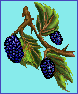
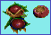
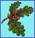
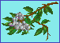
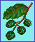
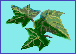
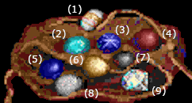

# Conquests of the Longbow: The Legend of Robin Hood. Руководство пользователя

## Содержание

- [Введение](#введение)
- [Гуд! Гуд! Робин Гуд!](#гуд-гуд-робин-гуд)
- [Деревья Друидов](#деревья-друидов)
- [Драгоценные камни](#драгоценные-камни)
- [Гербы](#гербы)
- [Правила игры в Мельницу](#правила-игры-в-мельницу)
- [Новые курсоры](#новые-курсоры)
- [Деньги](#деньги)
- [Подсчёт очков](#подсчёт-очков)
- [Настройки аркады](#настройки-аркады)
- [Бои на посохах](#бои-на-посохах)
- [Перед началом игры](#перед-началом-игры)

---

**ИСПОЛНИТЕЛЬНЫЙ ПРОДЮССЕР**: Кен Уильямс

**КРЕАТИВНЫЙ ДИРЕКТОР**: Билл Дэвис

**ДИРЕКТОР**: Кристи Маркс

**ПРОДЮССЕР**: Гурука Сингх Халса

**ГЕЙМ-ДИЗАЙНЕР**: Кристи Маркс

**АРТ-ДИЗАЙНЕР**: Кенн Нишиуйе

**ВЕДУЩИЙ ПРОГРАММИСТ**: Ричард Аронсон

**МУЗЫКАЛЬНЫЙ РУКОВОДИТЕЛЬ**: Марк Зайберт

**АНИМАТОРЫ**: Эрни Чан, Джеральд Мур, Эрик Каснер, Деанна Ялки, Френсис Пауэлл, Эл Рафтон, Диана Уилсон, Натан Ларсен, Тамра Дейтон

**ХУДОЖНИКИ ФОНОВ**: Эрни Чан, Эл Рафтон, Артуро Синклер, Джей Аллан Фридман, Терренс К. Фоллс, Джерри Джессурун, Дана М. Дин, Роджер Харди мл., Филлис Куччиара, Тереза Д. Тидд

**ПРОГРАММИСТЫ**: Боб Фишбах, Роберт Л. Мэллори, Тодд Пауэрс, Вана Бэйкер, Синтия Л. Гофф, Йоко Хаяши, Пабло Генис, Дж. Марк Худ, Кришнан Шанкар, Брайан К. Хьюз, Карлос Эскобар

**СИСТЕМНЫЕ РАЗРАБОТЧИКИ**: Джефф Стивенсон, Роберт Э. Хейтман, Дэн Фой, Ларри Скотт, Дж. Марк Худ, Эрик Харт, Марк Уилден, Крис Смит, Терри МакГенри, Чед Бай, Кен Кох, Джон Реттиг, Джон Крейн, Стивен Коллиер, Рэнди Мосс

**МУЗЫКАЛЬНОЕ СОПРОВОЖДЕНИЕ И ЗВУКОВЫЕ ЭФФЕКТЫ**: Обри Ходжес, Крис Бреймен, Кен Аллен, Орфей Хэнли

**ОТВЕТСТВЕННЫЙ ЗА КАЧЕСТВО**: Дэн Скотт

**АВТОР РУКОВОДСТВА**: Кристи Маркс

**ДИЗАЙНЕР РУКОВОДСТВА**: Глория Гарленд

**ИЛЛЮСТРАТОРЫ РУКОВОДСТВА**: Глория Гарланд, Натан Гамс, Шерил Суини, Билл Дэвис, Джон Шроудс, Эрни Чан, Эл Рафтон

---

## ВВЕДЕНИЕ

Добро пожаловать в CONQUESTS OF THE LONGBOW. Это моя вторая игра для Sierra On-Line и первая, где используется новая система курсоров-иконок - символов, обозначающих либо используемый объект, либо нужное действие.

Подробнее о курсорах игр Sierra On-Line и их использовании написано в отдельной памятке. Однако, я рекомендую прочитать разделы этого руководства про два новых кастомизированных курсора: ЛУК и КАРТА.

Для менее опытных игроков здесь представлен раздел ПЕРЕД НАЧАЛОМ ИГРЫ, который поможет разобраться в игровых процессах и отправиться в приключение.

Другие разделы этого справочника содержат информацию и иллюстрации к головоломкам и загадкам, которые встретятся в игре. Так что будет полезно держать его под рукой.

Здесь Вы также найдёте объяснение правил древней настольной игры Мельница, что тоже пригодится при прохождении CONQUESTS OF THE LONGBOW. Чтобы дать Вам возможность попрактиковаться и просто приятно провести время в набор мы включили печатную версию поля для игры в Мельницу.

Я буду рада получить Ваши письма с комментариями к игре после её прохождения. Информативные отзывы к прошлой игре очень ценны для меня и помогли усовершенствовать эту. 

Прошу, НЕ НАДО писать с просьбой подсказать что-нибудь. Я отвечаю на каждое письмо, которое получаю, и это может длиться неделями или даже месяцами (в зависимости от рабочей нагрузки). У Sierra On-Line множество служб поддержки, отвечающих на вопросы и дающих советы. Я бы хотела узнать, что Вам понравилось или не понравилось в любом из аспектов этой игры.

Отправляйте мне письма по адресу:

Christy Marx

c/o Sierra On-Line

P.O. Box 485

Coarsegold, CA 93614

Я хотела бы поблагодарить всех, кто сообщал о пиратстве и поддерживал меня, соглашаясь с тем, что пиратство - это неправильно, что это бездумное преступление. Оно пренебрегает работой творческих людей, корпящих над игрой в течение долгого времени. Каждый раз, когда один человек копирует игру и делится ею с другими или, хуже того, продаёт её, он ворует напрямую у меня. Больше года я кропотливо сосредоточенно тружусь и не хочу терять ни единого честно заработанного пенни. Это подобно краже сумочки.

Мне приходили длинные письма с пылкими речами о проблеме копирования и распространения программного обеспечения. Я не буду вдаваться в полемику. Возможно, всё не так просто, как с ярлыками “хорошо” и “плохо”, но одно ясно точно: пиратство - это воровство, пиратство - это неправильно.

Авторы некоторых писем, живущие за границей, рассказывали о ТЫСЯЧАХ продаж пиратских копий моей игры. Просто возмутительно, что кто-то таким образом крадёт мой труд. 

Один отправитель предположил, что этим могла бы заняться компания, так же, как магазины решают проблему краж с прилавков.

Допустим. Тогда компания увеличит цену продукта, чтобы покрыть убытки из-за пиратских копий. Значит, вы, те, кто КУПИЛ игру, платите и за этих пиратов. Разве это честно?

Осознанность - это первый шаг. Не участвуйте в пиратских махинациях и не позволяйте им совершаться. Да, наверняка очень сложно сказать “нет” другу, который так просит игру. Не отказывайте - пригласите к себе и играйте вместе, заодно объясните, почему распространение копий неправильно.

Дело не только в нелегальности, это вопрос этики. Под вопросом уважение ко мне, к художникам, программистам, композитору и всем тем, чьим трудом создавалась эта игра. Спасибо Вам за поддержку.

## ГУД! ГУД! РОБИН ГУД!

Жил ли на самом деле Робин Гуд? Насколько можно судить по многим исследованиям, ответ отрицательный. По крайней мере, не под этим именем.

Почти всё, что я расскажу здесь, взято из двух превосходных источников: "**Робин Гуд**" Дж. К. Холта и "**Разбойники средневековых легенд**" Мориса Кина. Обе книги упомянуты в библиографии. Настоятельно рекомендую их к прочтению всем любителям историй о Робин Гуде.

Были некогда средневековые разбойники, чья жизнь и “приключения" имеют параллели с балладами о полумифическом Робин Гуде. Я рассматриваю этого персонажа как синтез фактов и вымысла, историй про симпатичного героя и человеческой жажды авантюр.

Первое письменное упоминание о Робин Гуде датируется примерно 1377 годом.  В своём сочинении **Пирс Пахарь** пишет “...знаю я стихи о Робин Гуде...". Формулировка указывает на то, что к тому времени баллады и поэмы были уже достаточно хорошо известны, что и читатель наверняка знаком с ними, и пояснения излишни.

Самые ранние зафиксированные на письме фрагменты баллад и поэм относятся к 15 веку. Но в устном народном творчестве они были популярны лет ещё эдак за 200 до этого. 

Из этих баллад Робин предстаёт пред нами смелым удальцом, способным на хитрые запутанные трюки с переодеваниями. Малыш Джон - его правая рука - совершал подвиги, не менее вёрткие и дерзкие. Бывало, Робин спасал его, в иной раз он Робина.

Самые ранние истории о Робин Гуде повествуют о том, как он помог обедневшему Рыцарю, отдав ему деньги после ограбления Келаря Аббатства Св. Марии; как он переоделся Горшечником и обманом завёл Шерифа Ноттингема в лес; как он познакомился с Парнем из Гисборна перед состязанием в стрельбе, как пришлось сразиться и поразить его мечом, как потом в его одеждах вызволил он Малыша Джона от Шерифа; о том, как он, будучи сам спасён Малышом Джоном и Муком из плена, отправился в Ноттингемскую церковь; и о его смерти от руки Настоятельницы Кирклиса: истекая кровью, Робин всё же НЕ СТАЛ выпускать последней стрелы, обретя своё последнее пристанище и поставив тем самым точку в тех строфах.

За сим последовало множество других историй, теперь уже легендарных, но именно эти подобны семенам, из которых произросли все остальные. Сколько сказаний с течением времени было утеряно, то не были записаны, то записи не сохранились, знать всего наверняка невозможно. Единственный разбойник, появлявшийся в ранних версиях наряду с Малышом Джоном и Муком, сыном Мельника, - это Уилл Скарлет (также известный как Скарлок или Скателок). Другие спутники Робин Гуда были представлены позднее. Например, Брат Тук - лишь в 1417 году. Возможно, прототипом стал реально живший в то время бандит по имени Роберт Стаффорд, творивший беззаконие под созвучным прозвищем. 

Дева Мэриан, которая так сильно напоминает самого Робин Гуда, вошла в историю необычно. Героиня французской пьесы, ничего общего не имевшая с историей Робина, она появилась на весеннем празднестве где-то между 1450 и 1500 годами. А история о том, как Мэриан вошла в лес, переодевшись пажом, и сражалась с Робином, и вовсе была написана в 18 веке.

Робин Гуд жил во времена правления некого Короля Эдуарда, вероятно, Эдуарда II, но никак не Ричарда Львиное Сердце. Эта ассоциация образов появилась позднее, и после выхода романа “**Айвенго**” Сэра Вальтера Скотта только утвердилась в сознании.

Представления о Робине как о благородном защитнике, грабящем богатых и отдающим бедным, тоже появились позднее. Эти социальные идеи были совершенно чужды сочинителям первых баллад.

На протяжении веков Робин Гуд был народным героем, добродетельным разбойником, образцовым лучником, плутом и мудрецом. Его образ формировался и изменялся под стать каждой эпохе. И мы продолжаем любить его и славить в книгах и фильмах. 

В своих зелёных ли он трико или в чужом обличии, встреча ли это с Мэриан или другие обстоятельства, которые мы постоянно добавляем к рассказам, - Робин такой многообразный и всегда разный.

Неизменно лишь одно - он сам. Робин бросает вызов коррумпированной власти, смеётся пред лицом опасности, неустанно сражается с врагом и силой, и хитростью своей, ускользая, он возвращается и рвётся в бой. Таким он поселился в наших сердцах, в таком герое нуждалось человечество во все времена.

## ДЕРЕВЬЯ ДРУИДОВ

 Рябина...*Луис*

 Берёза...*Бет*

 Ежевика...*Муин*

 Падуб...*Тинн*

 Орешник...*Колл*

 Дуб...*Дуир*

 Ясень...*Нион*

 Бузина...*Руис*

 Ольха...*Ферн*

 Ива...*Селль*

 Плющ...*Горт*

Другие имена, которые тоже могут быть интересны:

Ель...*Алм*

Сосна...*Октах*

Тополь...*Еада*

Тис...*Идо*

На иллюстрациях изображены деревья со своими названиями и друидскими именами, которые встретятся во время игры в Conquest of the Longbow.

Примерно в 52 году до н.э. Юлий Цезарь писал о друидах следующее: "А ещё ведут они долгие дискуссии о телах небесных и их движении, о размерах Вселенной и Земли, об устройстве мира материального, о могуществе и характерах Богов...”.

Друиды исчезли давно, и о них известно очень немногое. Сохранились лишь отрывки сочинений, обнаруженные в трудах Цезаря и других римских историков, а также некоторые устные предания: к сожалению, передача знаний в письменном виде у них была под запретом. Также редко где упоминается, что особым почётом и властью в то время пользовались жрицы. Именно Веледа - Верховная Жрица друидов в Германии и Галлии - возглавила восстание против римлян в 70 году до н.э. Но к несчастью, в последствии была захвачена в плен и казнена в Риме.

Нам известно, что друиды верили в реинкарнацию, и верования их сосредотачивались вокруг культа дуба и омелы. Жизненной важностью для них обладали священные рощи, они же являлись центрами поклонения. Одним из древних произведений, сохранившихся до наших дней, является “Cad Goddeu”, что в переводе с валлийского означает “Битва деревьев”. Это длинная поэма, где в стихотворной форме были зашифрованы тайные имена священных деревьев. С определёнными деревьями были связаны некоторые буквы алфавита, месяцы и лунные циклы.

## ДРАГОЦЕННЫЕ КАМНИ

 

### АГАТ (1)

Обладает божественной силой и притягивает материальные блага. Лечит психическое здоровье, устраняет безумие и меланхолию. Используется для хорошего урожая. Защищает моряков в море.

### БИРЮЗА (2)

Приносит удачу. Меняя цвет, предупреждает об опасности. Защищает лошадей от хромоты. Защищает от травм при падении.

### САПФИР (3)

Лечит фурункулы. Оберегает целомудрие. Хранит секреты. Лечит болезни глаз. Камень Судьбы.

### СЕРДОЛИК (4)

Останавливает кровь, текущую из ран. Исполняет заветные желания. Лечит от кровоточивости дёсен. Сопровождает мёртвого в пути к перерождению.

### ЛАЗУРИТ (5)

Символизирует силу воды. Лечит болезни глаз. Камень Истины. Упавший на землю кусочек неба.

### ЯНТАРЬ (6)

Лечит лихорадку, слепоту и глухоту. Нейтрализует яд. Может заставить женщину сознаться в своих грехах.

### ГАГАТ (7)

Управляет демонами и имеет власть в подземном мире, где бродят мертвецы. Отводит Сглаз. Исцеляет укусы змей. Предотвращает отравление.

### ОПАЛ (8)

Предсказывает смерть больному. Делает своего владельца невидимым. Объединяет все цвета.

### КВАРЦ (9)

Замёрзший до состояния камня лёд, не способный растаять. Проводник небесного огня. Если держать во рту, он утолит жажду. Представляет собой Непорочное Зачатие.

## ГЕРБЫ

| | | | |
|-|-|-|-|
|  |  |    |  |
| ЮЖНЫЕ САКСЫ                    | ХРИСТИАНЕ БРИТАНЦЫ             | ВОСТОЧНЫЕ САКСЫ                  | КОРОЛЬ О. МЭН                    |
|  |  |  |   |
| ХРИСТИАНЕ УЭССЕКСЦЫ            | МОНАРХИ САКСОНСКИЕ             | КОРОЛИ ИРЛАНДСКИЕ                | КОРОЛИ МЕРСИЙСКИЕ                |
|  |  |    |  |
| КОРОЛИ НОРМАНДСКИЕ             | КОРОЛИ АНДЕГАВИОНСКИЕ          | КОРОЛИ ДАТСКИЕ                   | КОРОЛИ КОРНУОЛЛЬСКИЕ             |

*Источник: Атлас Тюдоров 1611 года, составленный и иллюстрированный Джоном Спидом. Сохранена оригинальная орфография.*

## ПРАВИЛА ИГРЫ В МЕЛЬНИЦУ

“Мельница" - одна из самых старых настольных игр, в которую играют и по сей день. Расчерченные доски находили в египетском храме 1400 года до н.э., в развалинах Трои, в усыпальнице эпохи Бронзового Века в Ирландии, в погребальном корабле короля викингов. Распространённое английское название “Morris”, возможно, произошло от французского варианта “merelles”.

Участвуют два игрока. У каждого по 9 фигур. Подойдёт что угодно: 9 монет, 9 фишек из покера и т.д. двух цветов.

На доске 24 “точки", куда можно положить фишку. Это углы квадратов и места пересечений соединительных линий.

Цель игры: строя "мельницы" забирать фишки противника с доски до тех пор, пока у него не останется только 2 фишки или возможности сделать какой-либо ход.

“Мельницей” называется положение 3 фишек одного игрока, выложенных в ряд без свободных точек между ними.

После каждого перемещения фишки, создающего такую мельницу, игрок может забрать одну фишку противника.

Вот некоторые примеры мельниц:

Х Х Х

Фишки, выстроенные по диагонали или не соединённые линией, не в счёт.

Это НЕ мельница:

Х Х Х

Начало игры: предварительно стоит определить, кто из игроков ходит первым. Тогда он кладёт свою фишку на любую свободную точку (всего их 29, как мы помним). Затем другой игрок кладёт свою. Так, они по очереди выкладывают все 9 фишек на доску.

При этом нужно стараться выполнить 2 задачи: построить мельницу и помешать это сделать противнику.

Когда все фишки (не считая проигранных из-за мельницы противника) будут находиться на доске, начнётся второй этап игры. Теперь игроки должны по очереди перемещать по 1 своей фишке на соседнюю свободную точку. Игрок не может обойти ни свою, ни фишку противника. Фишка не может перепрыгивать через всё поле. Ходы совершаются строго по линиям. 

Игрок, который построил мельницу, не может взять фишку одной из мельниц своего противника, если для этого нет других фишек.

Новую мельницу игрок может построить одной из фишек существующей мельницы (тогда она перестаёт быть таковой). Следующим ходом он может вернуть фишку на то же место, если эту точку не занял противник. 

Как-то так. Удачи!

## НОВЫЕ КУРСОРЫ

Чтобы ознакомиться с особенностями работы всех курсоров, пожалуйста, прочтите другое руководство к игре. Для **Conquests of the Longbow** были созданы два новых, дальше речь пойдёт конкретно о них.

ЛУК: курсор в форме ЛУКА функционирует так же, как и другие: их можно прокручивать до тех пор, пока не появится нужный, или выбрать в Строке Меню, нажав на соответствующее изображение. То есть, нажав на ЛУК, Вы выбираете для дальнейших действий КУРСОР-ЛУК.

КУРСОРОМ-ЛУКОМ Вы можете нажать на персонажа или предмет, в который хотели бы выстрелить из лука.

Прежде чем стрелять из лука, ОСТАНОВИТЕСЬ И ЗАДУМАЙТЕСЬ. То, что Вы теперь Робин Гуд, не означает, что нужно стрелять по всему, что попало в поле зрения, а угрозы луком не тому человеку могут иметь серьёзные последствия.

Для СТРЕЛЬБЫ (когда Вы прицеливаетесь, и стрела уже натянута) перемещайте КУРСОР-ЛУК вверх, вниз, влево и вправо, пока наконечник не будет указывать на Вашу цель. Для спуска стрелы остаётся один лишь щелчок кнопкой мыши.

Если Вы хотите выстрелить ещё раз, нажмите на лук рукой, чтобы зарядить новую стрелу.

КАРТА: КАРТА не отображается в курсорах. Чтобы её использовать, перейдите в Строку Меню и нажмите на ЗНАЧОК КАРТЫ там. В один миг Вы перенесётесь на соответствующую карту, где можно выбрать нужную Вам локацию.

Направления сторон света в пределах Шервудского Леса бессменны: север - верхняя часть экрана, запад - левая, юг - нижняя, восток - правая. Чтобы сориентироваться и найти Холм и Уотлинг-Стрит, нужно помнить, что дорога проходит примерно с севера на юг (как изображено на карте Графства).

Идти по Лесу порой очень долго. Если Вы торопитесь, нажмите на ЗНАЧОК КАРТЫ в Строке Меню. Появится главная карта НОТТИНГЕМШИРА (карта Графства). Чтобы отправиться в конкретное место, щёлкните КУРСОРОМ-ХОДЬБОЙ на соответствующей точке карты Графства. В картах есть локации Уотлинг-Стрит, некоторые участки Леса, город Ноттингем и Монастырь Топи.

КАРТА с функцией быстрого доступа будет полезна на протяжении всей игры. Она не только доставит Вас в укромные уголки леса, но и позволит в одно мгновение перескочить большие расстояния на север и на юг вдоль Уотлинг-Стрит. В помещениях и на некоторых локациях, а также в определённых ситуациях ЗНАЧОК КАРТЫ работать не будет.

После нажатия на город Ноттингем на карте Графства перед Вами откроется карта самого города. Нажав КУРСОРОМ-ХОДЬБОЙ по любому из доступных мест города, Вы попадёте в это конкретное место.

Нажатие на КАРТУ во время перемещения по улицам Ноттингема вернёт Вас к карте Ноттингема. Повторное нажатие КАРТЫ откроет основную карту Графства.

## ДЕНЬГИ

Всякий раз, когда у Вас при себе некоторая сумма денег, в инвентаре будет отображаться одна серебряная монета. Если денег не осталось, значок пенни в инвентаре пропадёт.

В то время в Англии это был единственный вид денег. Чтобы получить полпенни, монету разрезали пополам, для фартинга пенни нужно было поделить на четыре равные части. В 1193 году пенни был из чистого серебра и стоил гораздо больше, чем нам сегодня кажется. Не думайте, что слово "пенни" используется для обозначения незначительной суммы.

Чтобы дать кому-либо определённую сумму денег, нажмите на ИНВЕНТАРЬ, ВЫБОР ИНВЕНТАРЯ, затем на пенни. Тогда в качестве выбранного Предмета Инвентаря пенни появится в Строке Меню.

Теперь для выбора нужного активного курсора пролистайте их или нажмите на пенни в Строке Меню. Курсором-Монетой кликните на персонажа или предмет. Откроется ДЕНЕЖНОЕ ОКНО, отображающее состояние Вашего кошелька, и Вы увидите, сколько пенни, полпенни и фартингов Вы можете отдать.

В столбце слева отображается имеющаяся у Вас сумма. Справа от неё находится столбец со ЗНАЧКАМИ КОШЕЛЬКА. Нажимайте на них, если Вы достали монеты, но решили положить их обратно.

По центру Вы увидите пенни, полпенни и фартинг для выбора монеты конкретного номинала.

В столбце правее ЗНАЧКИ РУК. Нажмите на них нужное количество раз, чтобы выбрать сумму денег, которую Вы хотите дать. Например, если Вы хотите дать кому-то пенни и 2 фартинга, нажмите один раз на Значок Руки справа от пенни и 2 раза на Значок Руки справа от фартинга.

Справа от Значка Руки будет отображаться количество монет, которые Вы собираетесь отдать.

Право выбора - ОТДАТЬ деньги или ОСТАВИТЬ их себе - остаётся за Вами и на этом этапе. Чтобы принять окончательное решение, нажмите на одну из двух клавиш внизу. Это закроет Денежное Окно и, если Вы решили отдать деньги, они будут переданы выбранному персонажу или предмету. Деньги не будут списаны, если Вы нажали на кнопку ОСТАВИТЬ или если нажали ОТДАТЬ, но не выбрали монеты рядом со Значками Рук.

Чтобы просто узнать, сколько у Вас осталось денег, не открывая Денежное Окно, выберите ИНВЕНТАРЬ, ОБЗОР ИНВЕНТАРЯ и нажмите на пенни. Появится сообщение с информацией о наличии у Вас монет всех номиналов.

## ПОДСЧЁТ ОЧКОВ

В верхней части экрана, на Линии Статуса, Вы увидите три показателя: ВЫКУП, РАЗБОЙНИКИ и ОЧКИ.

ВЫКУП отображает общую сумму выкупа для спасения Короля Ричарда, которую удалось собрать в ходе игры. На успешность сбора и величину итоговой суммы влияет Ваша мудрость и стратегия. 

Раздел РАЗБОЙНИКИ показывает количество Ваших людей. Суждено им выжить или погибнуть в бою, зависит от выбранной тактики, Вашей хитрости и сноровки. Не дайте усомниться в своей компетенции и лидерских качествах.

ОЧКИ - это показатель заработанных и утерянных по мере прохождения игры очков по отношению к общему количеству, которое возможно получить за игру.

## НАСТРОЙКИ АРКАДЫ

Под АРКАДОЙ я имею в виду такие эпизоды, где исход игры решается в ограниченное время и сильно зависит от навыков игрока, его скорости и ловкости (например, стрельба из лука). В CONQUESTS OF THE LONGBOW таких эпизодов очень мало, и специально для тех, кто аркады не жалует, мы оставили возможность их обойти.

Для этого нажмите на ЗНАЧОК КОМПЬЮТЕРА в Строке Меню (второй справа). Откроется окно с кнопками выбора игры и ползунками. Ползунок для настройки АРКАДЫ - в дальнем правом углу. Курсором изменяйте настройки, передвигая ползунок от САМОГО СЛОЖНОГО уровня (“+”) до САМОГО ПРОСТОГО (“-”).

Если Вы выберете самый простой уровень, то автоматически выиграете все аркады и избавите себя от необходимости их проходить. Эти настройки можно поменять в процессе игры в любой момент.

ПРИМЕЧАНИЕ №1: Такой способ ПОБЕДЫ уменьшит общее количество очков, которое Вы можете заработать.

ПРИМЕЧАНИЕ №2: Мельница - стратегическая игра на сообразительность, поэтому автоматически выиграть эту игру невозможно. Однако настройка уровня сложности будет определять уровень мастерства Вашего противника.

## БОИ НА ПОСОХАХ

Вам доступны 4 атакующих движения (удара) и 4 оборонительных (блок, уклон и прыжок).

АТАКУЮЩИЕ ДВИЖЕНИЯ

ВЕРТИКАЛЬНЫЙ УДАР: Вы ударяете посохом сверху вниз. Это самый мощный из возможных ударов, однако Ваш корпус остаётся открытым для контратаки.

УДАР В ГОЛОВУ: удар противника по голове.

УДАР ПО КОРПУСУ: удар в центр туловища противника.

УДАР ПО НОГЕ: удар противника ниже колена.

ОБОРОНИТЕЛЬНЫЕ ДВИЖЕНИЯ

БЛОК ОТ ВЕРТИКАЛЬНОГО УДАРА: Вы блокируете мощный вертикальный удар противника, поднимая посох над головой.

УКЛОН: Вы уклоняетесь от удара по голове.

БЛОК КОРПУСА: Вы блокируете удар противника по туловищу.

ПРЫЖОК: Подпрыгивание на месте позволяет избежать удара противника по ногам.

_____ УПРАВЛЕНИЕ: МЫШЬ

Если Вы играете мышью, то для атаки и защиты Вам понадобится нажать на соответствующую часть тела Робина или противника. Соотношение частей тела и действий следующее:

АТАКУЮЩИЕ ДВИЖЕНИЯ

ВЕРТИКАЛЬНЫЙ УДАР: клик над головой противника.

УДАР В ГОЛОВУ: клик по голове противника.

УДАР ПО КОРПУСУ: клик по туловищу противника.

УДАР ПО НОГЕ: клик по ноге противника (ниже колена).

ОБОРОНИТЕЛЬНЫЕ ДВИЖЕНИЯ

БЛОК ОТ ВЕРТИКАЛЬНОГО УДАРА: клик над головой Робина.

УКЛОН: клик по голове Робина.

БЛОК КОРПУСА: клик по туловищу Робина.

ПРЫЖОК: клик по ногам Робина (также ниже колена).

_____ УПРАВЛЕНИЕ: КЛАВИАТУРА

Если Вы играете, используя кнопки клавиатуры, то для боя на посохах задействуйте цифровой блок:

7/ УКЛОН, 8/ ВЕРТИКАЛЬНЫЙ УДАР, 9/ УДАР В ГОЛОВУ

4/ БЛОК КОРПУСА, 6/ УДАР ПО КОРПУСУ

1/ ПРЫЖОК, 2/ БЛОК ОТ ВЕРТИКАЛЬНОГО УДАРА, 3/ УДАР ПО НОГЕ

_____ УПРАВЛЕНИЕ: ДЖОЙСТИК

Если у Вас джойстик, переместите стик в одну из 8 позиций и нажмите.

УКЛОН, ВЕРТИКАЛЬНЫЙ УДАР, УДАР В ГОЛОВУ

БЛОК КОРПУСА, УДАР ПО КОРПУСУ

ПРЫЖОК, БЛОК ОТ ВЕРТИКАЛЬНОГО УДАРА, УДАР ПО НОГЕ

## ОБРАТИТЕ ВНИМАНИЕ 

На последующих страницах Вы найдёте раздел “Перед началом игры” с советами и инструкциями.

Если Вы новичок в такого рода играх, можете прочитать его, чтобы получить общее представление о том, как играть и с чего начать. 

Если Вы уже опытный игрок, то чтение необязательного материала можно пропустить, чтобы преждевременно не раскрыть сюжетную информацию.

## ПЕРЕД НАЧАЛОМ ИГРЫ

В самом начале игры Вы окажетесь в своей пещере в Лагере Разбойников.

Наводите КУРСОР-ГЛАЗ на разные объекты, чтобы получить о них информацию, это Вам пригодится.

Нажмите КУРСОРОМ-РУКОЙ на рог. Теперь он добавлен в Ваш Инвентарь. Для проверки перейдите к строке меню и нажмите на Инвентарь. Откроется окно, и Вы сможете видеть, что у Вас с собой. Чтобы выбрать рог Предметом Инвентаря, нажмите на ВЫБОР ИНВЕНТАРЯ. Закройте окно Инвентаря, нажав “ОК”.

Нажмите КУРСОРОМ-РОГОМ на себя, чтобы протрубить.

РУКОЙ нажмите на маленький сундук и возьмите деньги. По желанию можете снова открыть Инвентарь, чтобы увидеть серебряную монету и удостовериться, что теперь у Вас есть деньги.

Выйдите из пещеры.

После того, как Вы пообщаетесь с людьми из Лагеря, поприветствовавшими Вас, обратите внимание, каким путём Малыш Джон пошёл к Холму, и куда отправился Уилл Скарлет, чтобы выйти на поляну.

Покиньте лагерь, двигаясь на северо-восток, в направлении, которое выбрал Уилл.

Продолжайте двигаться на север через две локации в лесу, и придёте на Стрельбище.

Нажмите ГОВОРИТЬ с Уиллом. Можно ГОВОРИТЬ с любым другим разбойником.

Нажмите РУКОЙ на венок, висящий на дереве.

Нажмите ЛУКОМ на дерево или на венок.

Вы целитесь заряженным луком. Перемещайте КУРСОР-ЛУК до тех пор, пока наконечник не будет указывать на Вашу цель. Кликните КУРСОРОМ-ЛУКОМ, чтобы спустить стрелу. Если Вы хотите выстрелить ещё раз, нажмите на лук рукой, чтобы зарядить новую стрелу.

После тренировки нажмите КУРСОРОМ-ХОДЬБОЙ в любой части экрана, чтобы покинуть эту локацию.

Отправляйтесь на юг, к Лагерю Разбойников. Через 3 локации в лесу идите на запад, пока не доберётесь до Холма с видом на Уотлинг-Стрит. С этого перевала Вы сможете созерцать улицу, оставаясь незамеченным. Обратите внимание на то, что говорит Малыш Джон.

После того, как Малыш Джон Вас поприветствует и уйдёт, оставайтесь некоторое время на месте. Вскоре Вы станете свидетелем, как Человек Шерифа тащит за собой крестьянку. Нажмите на них ГЛАЗОМ, чтобы получить дополнительную информацию.

Чтобы перехватить их, спуститесь вниз по перевалу - идите левее, нажмите ХОДЬБОЙ на дороге или РУКОЙ на мужчине или женщине.

Вы выйдете на Уотлинг-Стрит и встретитесь лицом к лицу с Человеком Шерифа. Здесь не помешало бы сохраниться. Будьте рассудительны, ибо Ваши слова, предложения и поступки определят судьбу этой женщины.

СОВЕТ НАПОСЛЕДОК

С некоторыми персонажами порой нужно говорить по несколько раз, чтобы узнать всё, что он или она может рассказать. Нажимайте ГОВОРИТЬ на одном и том же персонаже, пока он не начнёт повторяться. Чаще останавливайтесь и сохраняйте игру, особенно если Вам кажется, что Вам грозит опасность.
