**День 1**

Берем рог `+50`, деньги из шкатулки `+50`, выходим.

Идем к вдове (избушка на карте).

Идем на смотровую площадку (четыре экрана налево от лагеря) и ждем человека шерифа. Спускаемся и стреляем в стражника `+100`. Даем женщине четвертак `+50`.

Идем на стрельбище (два экрана наверх от лагеря). Говорим с Саймоном, стреляем по мишени, даем четвертак Саймону `+10`.

> Итого: 260

**День 2**

Выходим. Идем к вдове.

От вдовы два экрана вниз и один налево, потом обратно направо и снова налево.

Стреляем в монаха `+100`, забираем туфлю `+100` и уходим (_можно перед этим потрубить в рог и поболтать с соратниками_).

> Итого: 460

**День 3**

Идем на смотровую площадку и ждем нищего. Даем ему четвертак `+100`. (_в этом моменте игра меняет темп на медленный, можно поменять обратно_).

Идем в город к сапожнику и отдаем ему туфельку `+25` и получаем гребень `+25`.

> Итого: 610

**День 4**

Идем на смотровую площадку и ждем стражника. Спускаемся убиваем стражника `+100` даем охотнику четертак `+50`.

Идем в ивовую рощу. Отдаем Мэриан гребень `+50` и изумруд `+50`.

> Итого: 860

**День 5**

Идем к вдове.

Идем на смотровую площадку и останавливаем монаха аббаства в коричневой мантии (_если попался монах топи в черной мантии, отыргрываем шестрой день вместо пятого и наоборот_).

Трогаем монаха рукой, получаем его сутану `+75`.

Идем в город в аббатство св. Марии `+10`.

> В рандомной палате справа спрятана пасхалка. И одно интересное место - слева вторая сверху

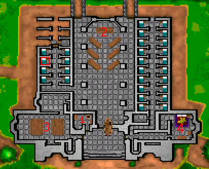

Идем в прачечную (1) и тырим робы `+50`

Идем в часовню (2) и заходим в правую дверь `+10`. Проходим лабиринт, заходим в дверь `+100`

  
Прохождение лабиринта

  
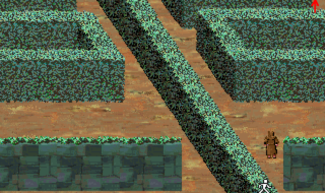
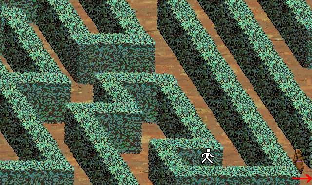
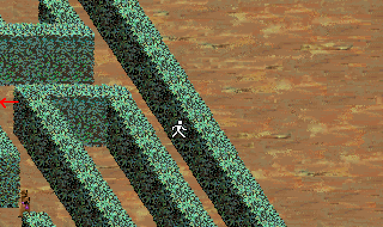
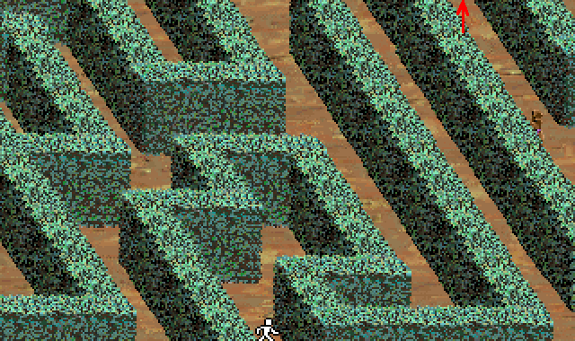
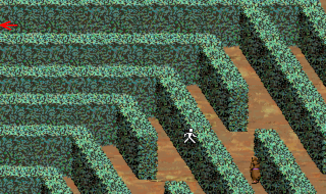

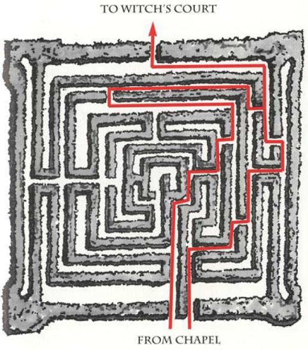

Возвращаемся обратно тем же путем и идем в трапезную (3).

> Небольшая пасхалка, если использовать изумруд на гобелене

Забираем у Аббата пустой бочонок `+25` и дуем в паб.

В пабе смотрим на ведро на веревке `+10`, отдаем бочонок трактирщику `+25`.

Два раза болтаем с человеком за столом. Делаем ставку - даем 4 пенни. Выигрываем в игру и получаем аметист `+50`.

  
Правила игры

  
Игра разделена на две стадии: сначала ставим фишки на доску, когда фишки расставлены перемещаем.
Ставить можно на углы и пересечения линий. Если поставить 3 своих фишки в один ряд соединенный линией, забираем фишку противника. Нельзя забрать фишку, если из нее составлен ряд. Стараемся поставить 3 в ряд и не даем поставить противнику. Цель: оставить противника с двумя фишками.

Самые выгодные места - с 4 соседями. На этапе расстановки стараемся ставить рядом с фишками врага, при этом занимая выгодные позиции. Если поставить две в ряд, противник сразу занимает третью, поэтому стараемся просто не потерять фишки. На втором этапе пытаемся построить ряд. Потом можно ломать ряд и собирать снова и повторять до победы.

  
Если совсем туго

Можно просто повторять ходы за видеопрохождением:

Воздействуем рукой на решетку, потом на кран второго слева бочонка `+100`.

Идем направо и прямо, выходим к аббату. Соглашаемся выпить с ним. Кидаем аметист в кружку `+50`. Постоянно болтаем с аббатом `+25`. Когда он уснет забираем бочонок и его кошелек `+10`.

Идем в покои аббата (4). Достаем из под правой подушки головоломку `+25`. Возвращаем подушку на место `+10`.

Выходим из аббаства и идем в замок. Даем стражнику 1 пенни `+50`.

Идем в паб. Возвращаем трактирщику пустой бочонок `+10` и отдаем 12 пенни `+20`. Проходим через решетку в пещеры. Идем налево. Смотрим в замочную скважину. Когда стражники уйдут, заходим в помещение и кладем на стол 3 с половиной пенни `+75`. Возвращаемся. Когда стражники уйдут `+100` заходим, открываем люк и спускаем робы парням `+150`.

Выходим через паб (надо будет ответить "Да") `+50`. Благославляем шерифа (голосом на него) `+10`.

Возвращаем сыновей вдове `+300`, получаем в награду золотую сеть `+50`.

> Итого: 2250

**День 6**

Идем на смотровую площадку и останавливаем монаха топи в черной рясе.

Дуем в рог. Угрожаем луком, соглашаемся на поединок. Лупим монаха, получаем его рясу и пожитки `+100`.

Идем в монастырь топи. Спускаемся, дуем в свисток `+25`, садимся в лодку.

Отдаем стражнику свисток и мешочек с камнями.

Отгадываем три загадки с камнями `+100`.

> Загадка с камнями - это чистой воды защита от копирования. В руководстве есть описание всех камней, надо выбрать три камня с соответствующими ситуации свойствами.

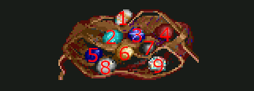

| Начало загадки                         | Камни
|----------------------------------------|-------
| Я перейду семь морей                   | 5 7 9
| На мой зов слетаются демоны            | 4 7 8
| Коль друг мой был не в добром здравии  | 4 7 8
| Лихорадка довела меня до безумия       | 1 4 6
| Я стар, и слух меня подводит           | 6 8 9
| Я должен пойти в бой                   | 4 5 9
| Печаль давит на душу                   | 1 4 8
| Я боюсь трёх вещей                     | 1 3 5
| Я построю корабль                      | 1 2 3
| Осколок неба упал к ногам моим         | 5 6 7
| Ветви моих деревьев согнулись          | 1 4 9
| Засуха продолжается                    | 1 5 7
| Я должен скакать на огненном коне      | 2 3 7
| Летом мой лёд не тает                  | 3 5 7
| Увы, тоска лежит на моих плечах        | 1 2 6
| Я лежу при смерти                      | 4 6 7

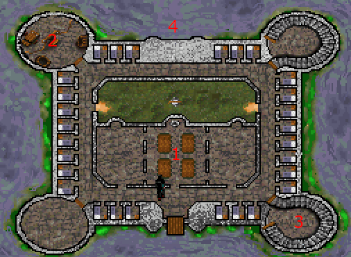

В монастыре идем в трапезную (1) потом в башню (2).

Освобождаем карлика `+100`.

Идем в башню (3). Роняем кубок. Забираем со стола свиток со стихами `+150`. Смотрим на стеллаж со свитками. Забираем свиток руки (самый нижний посередине) `+100`.

Идем к карлику (2). Даем ему свиток со стихами `+300` и уходим в потайной ход `+10`.

Перед тем как сесть в лодку даем Фулку четвертак `+25`. Садимся в лодку. Жмем на лица в правильной последовательности `+100`.

> Решение этой головоломки в одном из свитков библиотеки

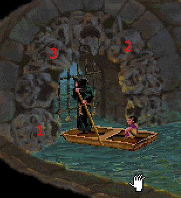

Получаем от фулка серебряное кольцо `+25` и свиток со стихами.

> Итого: 3285

**День 7**

Выходим из пещеры и идем в ивовую рощу.

Даем Мэриан свиток руки `+200`. Запоминаем какой герб должен показать ученый. Даем изумруд `+50`.

Идем в лес ловить пикси. Находим просторную поляну, встаем на середину, кидаем золотую сеть, когда пикси будет пробегать мимо `+10`.

> Ради интереса можно выстрелить по пикси из лука

Отгадываем загадки дуба `+200`.

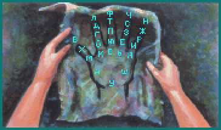

Ы = Ь

Щ = Ш

Й = И

| Загадка                     | Ответ
|-----------------------------|-----------
| Я сердце, что не бьётся     | ДЕРЕВО
| Высокого происхождения я    | СНЕГ
| Как раскрытая ладонь        | ПЕРО
| Моё сокровище, золото       | УЛЕЙ
| Мой первый хозяин           | МЕХ
| Из металла иль кости        | ГРЕБЕНЬ
| Из матери вышел             | СЫР
| Я двулика, но с одним лицом | МОНЕТА
| Я как окно и как лампа      | ГЛАЗ

> Итого: 3745

**День 8**

Выходим и идем на смотровую площадку. Ждем лучника, спускаемся. Предлагаем ему деньги `+100`.

Идем в город на ярмарку.

> Ярмарка кишит пасхалками и шутками. Рекомендуется поговорить со всеми и все обследовать

Ищем ученого в серых одеждах и шляпе, который ходит по ярмарке. Подходим к нему и разговаривем. Отвечаем "Да" на герб, о котором говорила Мэриан `+100`. Отдаем свиток `+50`. Соглашаемся взять деньги.

  
Гербы

  
| Герб                         | Значение
|------------------------------|-----------
| | asdasdasd
| | asdasdasd
| | asdasdasd
| | asdasdasd
| | asdasdasd
| | asdasdasd
| | asdasdasd

Даем четвертак попрошайке с одной ногой `+10`. Даем четвертак лежачему попрошайке `+10`. Даем два четвертака предсказателю судьбы `+25`. Покупаем шарф за 6 четвертаков (торговец рядом с забором слева от предсказателя) `+25`. Покупаем масло за 2 пенни (лавочник рядом со свиньей) `+25`.

Идем на турнир в лево до упора. Платим 1 пенни. Стрелям, выигрываем золотую стрелу.

> Чем выше ползунок АРКАДА в настройках, тем дальше будут мишени. Чтобы пропустить стрельбу можно поставить уровень аркады на минимум, но тогда не получим очков.

> Итого: 4290

**День 9**

Выходим из пещеры и идем к дубу. Выходим на соседний экран, потом обратно к дубу и еще раз. На второй раз Робин начнет бегать и заиграет тревожная музыка. Используем руку на себя и набираем ДУИР `+75`.

Идем на смотровую площадку. Останавливаем ювелира. Дважды воздействуем на него рукой `+100`.

В инвентаре открываем деревянную шкатулку и используем на себя `+25`.

Идем в замок. Говорим со стражником `+10`.

Говорим с шерифом, показываем украшения. Когда стража вернется, забираем украшения `+300`.

> Итого: 4800

**День 10**

Открываем свиток Фулка и читаем. Записываем первые буквы имен. В том же порядке набираем эти буквы на головоломке `+100`. Надеваем кольцо огня.

Выходим, дуем в рог. Выбираем вариант Джона.

Идем в паб. Три раза говорим с трактирщиком `+50`.

Идем направо, выходим в аббатство. Идем к алтарю. Сохраняемся, так как можем не успеть. Заходим в дверь справа. Снова проходим по лабиринту и открываем дверь `+500`.

Используем изумруд на Мэриан `+300`. Записываем пароль.

> Итого: 5750

**День 11**

Выходим, дуем в рог. Выбираем план Тука `+1000`.

> Итого: 6750

**День 12**

За нами снова охотятся. Снова идем к дубу, бродим вокруг и вводим слово ДУИР `+75`.

Идем на смотровую площадку. Спускаемся к рыцарю. Набираем пароль на руке `+50`. Набираем пароль еще раз. Стреляем в рыцаря `+50`. Обыскиваем рыцаря `+50`. Дуем в рог и показываем письмо Малышу Джону `+50`.

> Итого: 7025

**День 13**

Идем к монастырю. Снимаем кольцо огня, надеваем кольцо воды. Говорим с огоньками. Садимся в лодку. Следуем за огоньками.

Набираем на руке слово ГОРТ `+25`. По плющу лезем наверх в окно `+25`.

Даем рыцарю письмо `+100`. Набираем на руке пароль для рыцаря `+50`.

Сохраняемся и уворачиваемся от камней (можно управлять Робином на стрелках) `+100`.

> Итого: 7325
